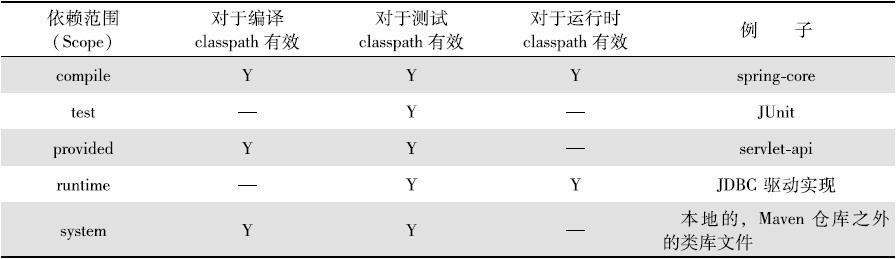
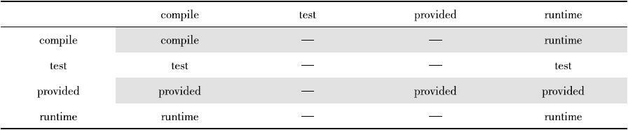

#### **依赖**

- **依赖范围**

  1. compile：编译依赖，默认的依赖范围，对于编译、测试、正式运行三中都有效。
  2. test：测试依赖，只对测试代码有效，在编译主代码或者正式运行时无法使用此类依赖。典型的就是JUnit,只有在编译测试代码及运行测试代码时才生效。
  3. provided：已提供依赖范围，在编译测试时生效，但在正式运行时无效，典型例子是servlet-api,运行时WEB容器赢提供，无需重复引入。
  4. runtime：运行时依赖，在测试和正式运行时生效，编译时无效。
  5. import：

- **依赖传递**

  

  

- **依赖调解**

  ​	当发生依赖重复冲突时，maven根据第一原则进行处理，如果不满足第一原则，则按照第二原则处理。

  1. 第一原则：最优路径优先，即最短路径。
  2. 第二原则：第一声明优先，即按照声明顺序选择。

- **排除依赖**

  ​	通过exclusions及子元素exclusion来排除依赖，声明exclousion时只需要groupId和artifactId，不需要指定version,因为只需要groupId和artifactId就能唯一定位依赖。

------

####  **仓库**

